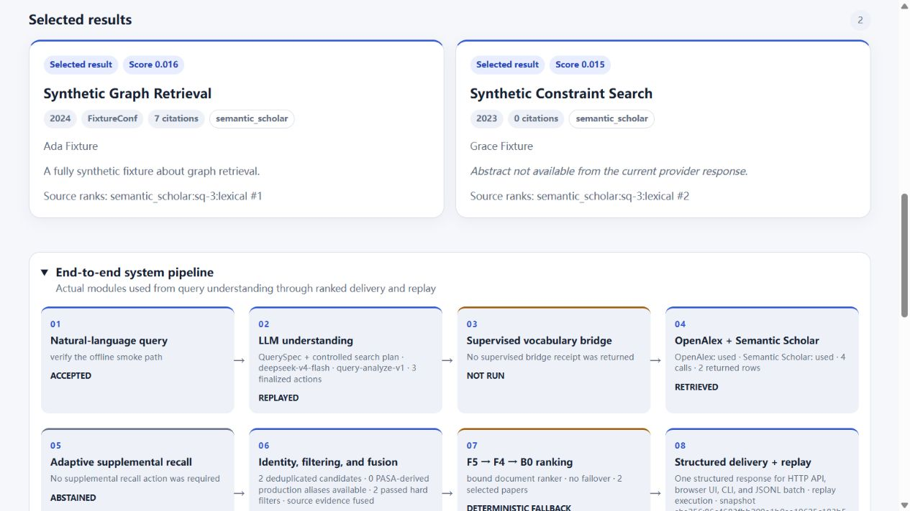
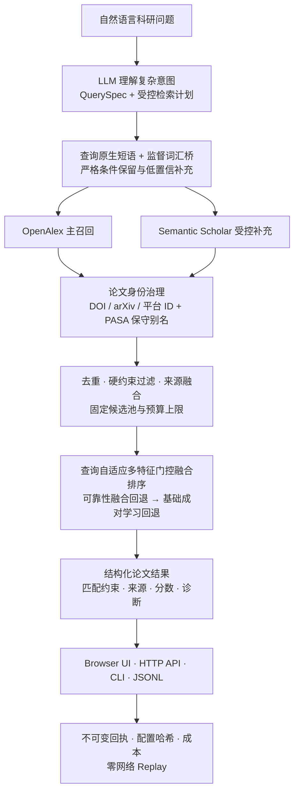

<div align="center">

# VivaAI

### 复杂科研查询的智能论文搜索与推荐

把一段自然语言科研问题，转化为**受控检索动作、可追溯候选、可解释排序结果与可复现执行证据**。

<p>
  
  
  
  
  
</p>

[90 秒验证](#quickstart) · [端到端流程](#pipeline) · [生产证据](#evidence) · [评委操作手册](docs/judge-guide.md) · [批量评测说明](docs/evaluator-submission-quickstart.md)

</div>

> [!TIP]
> **评委最短路径：**运行下方零网络 Replay，查看生成的论文标识与顺序，再进入浏览器 UI 检查 QuerySpec、召回动作、候选治理、排序、成本和来源轨迹。整个过程不需要 API 密钥。

<p align="center">
  
</p>

<p align="center"><sub>当前正式运行包的零网络安全回放界面。截图使用合成示例数据，只证明 UI、排序链和回放链可执行，不作为在线检索质量或比赛成绩。</sub></p>

## 为什么是 VivaAI

传统关键词搜索很难同时表达“研究任务是什么、采用什么方法、使用什么数据集、限定哪些年份、排除哪些论文”。VivaAI 面向这类完整科研问题，将意图理解、受控召回、论文身份治理、固定候选池排序和不可变回执组织为一条统一生产链。

| 🧠 复杂意图理解 | 🔎 多源可追溯召回 | 🛡️ 可审计交付 |
| --- | --- | --- |
| LLM 解析任务、方法、数据集、年份、实体与否定条件，但不直接编造论文标识。 | OpenAlex 主召回，Semantic Scholar 按门控受控补充；监督词汇桥处理跨词汇表达。 | DOI、arXiv 与平台标识统一，固定候选池内排序，并保存成本、来源、配置哈希和 Replay 证据。 |

### 核心特点

- **科研问题而非关键词列表**：从自然语言生成结构化 QuerySpec 和最多六个受控主检索动作。
- **跨词汇召回**：由 7,502 条监督查询训练的词汇桥，在满足门控时替换低价值回退动作，而非无限追加请求。
- **多源但不虚构贡献**：OpenAlex 承担主召回；Semantic Scholar 只有实际执行并产生候选时才计入来源证据。
- **公平候选池**：先完成身份统一、PASA 保守别名去重、硬约束过滤和来源融合，再让所有排序方法面对同一候选集合。
- **固定生产选择**：生产默认、第一回退和紧急回退顺序固定，不按单条查询动态挑选模型。
- **同一服务，多种入口**：浏览器 UI、HTTP API、命令行和 JSONL 批量评测共享应用服务、生产锁和候选池语义。
- **Live 可验证，Replay 可复现**：真实调用生成不可变回执；Replay 从相同回执零网络重执行，复现论文标识与顺序。

<a id="pipeline"></a>

## 端到端系统流程



### 每个模块负责什么

| 模块 | 生产职责 | 明确边界 |
| --- | --- | --- |
| LLM | 理解科研意图、生成 QuerySpec、规划受控动作 | 不直接给出论文 ID，不决定最终论文顺序 |
| 监督词汇桥 | 将查询表达映射为 OpenAlex 更可能命中的技术表达 | 最多提供一个受控动作，条件不满足时弃权 |
| OpenAlex | 主候选召回与论文元数据 | 返回的是候选，不是最终答案 |
| Semantic Scholar | 对低置信度或门控命中的查询进行补充召回 | 可能待命或零新增，界面按事实展示 |
| PASA 别名 | 补充论文身份别名，提升跨来源去重能力 | 不把 PASA-only 论文伪装为线上候选 |
| 确定性执行器 | 执行预算、过滤、供应商调用、候选上限和回执封存 | 不允许开放式无限搜索 |
| 文档排序器 | 在固定候选池内计算最终顺序 | 默认与回退顺序由制品固定 |

<a id="quickstart"></a>

## 90 秒零网络验证

要求 Windows PowerShell、Python 3.11 与 [uv](https://docs.astral.sh/uv/)。示例不访问 LLM、OpenAlex 或 Semantic Scholar，也不需要 `.env`。

```powershell
git clone https://github.com/Tianyuai/AI-Projects.git
Set-Location AI-Projects
uv python install 3.11
uv sync --locked

uv run --no-sync --no-env-file python scripts/run_evaluator_package.py `
  --queries examples/safe-replay/queries.jsonl `
  --output runs/safe-replay/predictions.jsonl `
  --lock examples/safe-replay/replay.lock.yaml `
  --snapshot-manifest examples/safe-replay/snapshots/smoke/snapshot-manifest.json `
  --artifact-root examples/safe-replay `
  --capture-output-root runs/safe-replay/captures `
  --mode replay
```

通过标志包括：

- `mode=replay`；
- 查询顺序与输入一致；
- 产生结构化论文 ID；
- `test_partition_touched=false`；
- 不产生新的外部费用。

完整安装、UI、API、单条 Live、批量 JSONL 和故障排查见 [评委操作手册](docs/judge-guide.md)。输入输出合同见 [批量提交说明](docs/evaluator-submission-quickstart.md)。

<details>
<summary><strong>需要真实在线演示？</strong></summary>

Live 会调用已配置的 LLM 和检索供应商，产生真实 token、请求次数与费用，并在完成后封存不可变回执。密钥只应通过本地环境变量注入，不能写入仓库、命令历史、截图或录屏。

推荐流程：

1. 先运行上面的 safe replay 和运行包完整性校验；
2. 按 [评委操作手册](docs/judge-guide.md) 执行一条 Live，并启用即时 Replay 验证；
3. 从同一回执启动 UI Replay，稳定讲解 QuerySpec、动作、候选、排序、成本与 Provenance；
4. 只陈述本次真实执行的供应商状态，不把 Replay 称为“正在联网”。

</details>

## Live 与 Replay

| 维度 | Live | Replay |
| --- | --- | --- |
| 外部调用 | 真实调用 LLM、OpenAlex；S2 按门控补充 | 不发起新的网络或 LLM 请求 |
| 成本 | 产生真实 token 与供应商费用并写入回执 | 可复现原费用记录，本次不新增外部费用 |
| 稳定性 | 受网络、限速和供应商状态影响 | 从不可变快照确定性重执行 |
| 作用 | 证明真实工程链贯通 | 复现相同论文标识、顺序和执行证据 |

## 生产排序与候选治理

### 固定三级排序选择

| 顺序 | 对外方法名称 | 内部映射 | 何时使用 |
| --- | --- | --- | --- |
| 默认 | 查询自适应的多特征门控融合排序器 | F5 | 正常生产请求 |
| 第一回退 | 可靠性融合排序器 | F4 | 默认制品缺失、哈希错误或初始化失败 |
| 紧急回退 | 基础成对学习排序器 | B0 | 前两级均不可用 |

生产选择文件明确设置 `per_query_model_switching=false`。方法、数据集、年份、否定条件和实体特征只在查询存在有效条件、候选中存在有效对比证据时激活，避免无条件叠加噪声。

### 候选池上限

- 生产基线：最多 300 条原始候选、200 条去重候选、50 篇结构化输出；
- 受控补充被激活时：总量最多 350 条原始候选、250 条去重候选；
- 所有新增候选先进入同一身份统一、去重、过滤和来源融合流程，再参与排序；
- 监督词汇桥、跨词汇补充和低置信 LLM 补充均有独立门控、动作数与预算上限。

配置与哈希绑定见 [生产 Live 锁](deliverables/evaluator/live-evaluator.lock.yaml) 和 [生产排序选择](artifacts/models/production-document-ranker-selection.json)。

<a id="evidence"></a>

## 已封存的生产证据

| 证据 | 规模 | 能证明什么 |
| --- | ---: | --- |
| [监督词汇桥制品](artifacts/models/supervised-lexical-bridge-openalex-v2/manifest.json) | 7,502 条训练查询 | 跨词汇扩展来自监督学习，并明确记录测试分区未触碰 |
| [生产排序选择](artifacts/models/production-document-ranker-selection.json) | 18,314 条可训练完整查询 | 已完成全量查询级 OOF、最终全量拟合与默认/回退制品哈希绑定 |
| [生产排序器清单](artifacts/models/gated-feature-fusion-18314-unified-context-v3-v1/manifest.json) | 538 条独立冻结查询 | 承担独立回归门禁，不参与生产模型训练 |
| [评委运行包](deliverables/submission/README.md) | 257 个清单文件 | 运行代码、UI、模型、锁文件和安全 Replay 可独立校验 |

> [!IMPORTANT]
> 这些数字分别描述训练规模、独立回归门禁和工程交付清单，不是公开集或隐藏集的官方比赛成绩。单条 Live 演示只证明工程链贯通。

## 统一交付入口

| 使用者 | 入口 | 输出 |
| --- | --- | --- |
| 研究人员 | Browser UI | 查询理解、召回动作、排序结果、成本与来源轨迹 |
| 应用系统 | HTTP API | 同一服务生成的结构化 JSON |
| 本地开发者 | CLI | 单条查询、服务启动与回放验证 |
| 评委与批处理 | JSONL | 稳定的 `query_id → selected_paper_ids` 合同 |

所有入口共用同一个应用服务与生产锁，不会为公开集、隐藏集、浏览器或命令行维护不同排序规则。

## 项目结构

```text
src/paper_search/       统一应用服务、召回、排序、API、CLI 与 UI
artifacts/              生产模型、词汇桥、PASA 身份别名及哈希清单
deliverables/evaluator/ 生产 Live 锁与评委交付配置
examples/safe-replay/   无密钥、零网络、可重复运行的安全样例
scripts/                运行包构建、验证、训练与评测工具
tests/                  单元、集成、评测合同和回放一致性测试
docs/                   评委、批量评测与生产就绪说明
```

### 文档导航

| 目标 | 文档 |
| --- | --- |
| 第一次运行与 UI 演示 | [评委操作手册](docs/judge-guide.md) |
| 公开/隐藏测试 JSONL 合同 | [批量提交说明](docs/evaluator-submission-quickstart.md) |
| 发布包内容与校验方式 | [可提交评测代码包](deliverables/submission/README.md) |
| 生产与评委就绪状态 | [生产就绪说明](docs/production-and-judge-readiness.md) |
| 安全 Replay 的输入与证据 | [安全回放说明](examples/safe-replay/README.md) |

## 发布包完整性校验

```powershell
uv run --no-sync --no-env-file python scripts/build_evaluator_release.py
uv run --no-sync --no-env-file python scripts/verify_evaluator_release.py `
  --release-root deliverables/submission/vivaai-paper-search-evaluator-runtime
```

ZIP、`MANIFEST.sha256` 和 `RELEASE.json` 共同给出精确文件清单、生产模型选择、锁文件和逐文件 SHA-256。训练扩充脚本不进入评委运行包；未来模型晋升只替换版本化制品并重新生成生产锁，不改 UI/API/CLI/JSONL 合同。

## 安全与数据边界

仓库和评委运行包不应包含：

- `.env`、API 密钥、邮箱或个人绝对路径；
- 私有训练数据、Gold 标签、最终或隐藏测试查询；
- 未晋升模型、一次性调试缓存或历史运行目录；
- 人工修改的论文顺序、分数、来源字段或伪造供应商结果。

新增模型或召回策略只有在冻结证据完整、测试分区未触碰、没有明显分层退化且 Live/Replay 一致性通过后，才能更新生产制品和锁文件。

---

<div align="center">

**Complex query in. Verifiable papers out.**

VivaAI · Evidence-first academic retrieval

</div>
