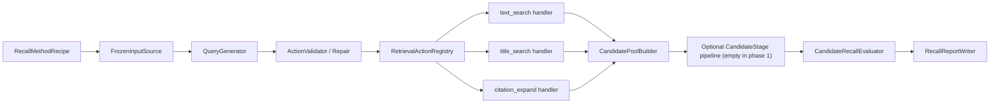

# 模块化候选池召回实验台设计

## 1. 背景

当前检索实验通常为每个假设编写独立脚本。脚本同时处理方法逻辑、冻结输入、LLM 调用、Provider 调用、预算账本、快照、回放、完整性校验、指标和 Gate。该结构适合封存正式证据，但不适合快速复用：更换搜索词生成方法时，会重复实现大量与方法无关的外围流程。

本设计建立一个模块化的候选池召回实验台。第一阶段只回答一个问题：给定搜索词生成或检索方法，完整候选池能够召回多少冻结 Gold 论文。过滤、排序、Top-50、最终 Precision/F1 和正式晋升在候选池召回满足要求后再单独设计。

## 2. 目标与非目标

### 2.1 目标

- 普通搜索词生成方法只需新增或修改 Prompt/YAML，不再新写完整实验脚本。
- DeepSeek 可在 Oracle 模式查看 Gold 论文内容，用于验证搜索方法的召回可行性。
- Blind 模式完全隐藏 Gold，用于后续泛化验证。
- 文本搜索、标题搜索和引文扩展分别实现、分别测试，并通过注册表组合。
- 冻结输入来源可替换；本地冻结格式变化时只替换输入适配器。
- 候选池构建、召回评估、报告和错误处理均为独立模块。
- 为后续过滤、排序、筛选和其他候选处理阶段保留显式插槽，但第一阶段不启用这些阶段。
- 优先复用现有 OpenAlex、引用扩展、LLM、ID 规范化、去重和评测实现。
- 用历史冻结方法验证实验台：回放必须精确一致，DeepSeek 重新生成允许在预注册误差范围内波动。

### 2.2 非目标

- 不训练或微调 LLM、Embedding、Reranker。
- 不在第一阶段评估过滤、排序、RRF、Top-50 或最终 F1。
- 不把 Oracle 结果解释为泛化能力或正式比赛成绩。
- 不删除或覆盖历史脚本、封存运行和证据。
- 不为尚未出现的 Provider 或处理阶段预实现业务逻辑。

## 3. 总体架构



组合根只负责根据配置装配接口，不包含方法判断。注册表只映射动作名到处理器；删除处理器、添加处理器或替换实现不影响生成器、候选池和评估器。

## 4. 模块边界

### 4.1 `RecallMethodRecipe`

方法配置是实验的唯一声明入口，至少包含：

```yaml
method_id: query-evolution-v2
generator:
  type: deepseek_prompt
  prompt: configs/prompts/query-evolution-v2.yaml
  model: deepseek-v4-flash
  temperature: 0
  gold_visibility: oracle
  max_generated_actions: 2
  repair_attempts: 1
retrieval:
  allowed_actions: [text_search]
  max_results_per_action: 50
  max_total_actions: 3
evaluation:
  repeat_count: 3
  compare_with: historical-query-evolution-v2
  gold_count_tolerance: 1
  macro_recall_tolerance: 0.02
  retained_gold_min: 0.90
  required_passing_repeats: 2
```

配置加载器禁止未知字段并校验跨字段约束。方法配置不允许嵌入任意 Python 路径或执行任意代码。

### 4.2 `FrozenInputSource`

冻结输入通过协议读取，不让生成器或评估器直接访问本地文件格式：

```text
load_queries(sample_binding) -> FrozenRecallDataset
load_historical_baseline(binding) -> HistoricalRecallBaseline | None
```

首版实现本地正式运行适配器，读取既有 Gold、identifier map、business/execution 记录和依赖快照。后续若认为本地冻结方式不合理，只需新增或替换该适配器。核心模块只依赖规范化后的 `FrozenRecallDataset`。

适配器负责校验：查询 ID 唯一、Gold 关联无重复、输入哈希匹配、Oracle/Blind 分区不重叠、历史比较分母一致。

### 4.3 `QueryGenerator`

统一输入为 `RecallGenerationContext`：

```text
query_id
original_query
query_spec
seed_queries
seed_candidates
observable_state
gold_documents
```

- Oracle 模式的 `gold_documents` 包含标题、摘要、作者和年份，不包含 DOI、OpenAlex ID 或可直接作为答案提交的标识符。
- Blind 模式完全移除 `gold_documents`。
- `seed_candidates` 只包含上一轮实际检索到、可由 Provider 验证的候选及其规范 ID；引文扩展从这里选择种子，不能把 Gold 论文偷偷作为种子。
- `observable_state` 只允许包含运行时可观察信息，不允许包含 Gold 命中情况。
- 第一阶段允许 `observable_state=null`；后续多轮搜索可在不改变接口的情况下填入状态。

首版生成器：

- `DeepSeekPromptGenerator`：根据 Prompt 生成搜索动作。
- `FixedActionGenerator`：读取历史搜索动作，用于精确回放。
- `ManualActionGenerator`：读取人工预先写好的动作，用于不调用 LLM 的快速对照。

新增普通搜索词方法通常只增加 Prompt/YAML。只有新增生成机制时才实现新的生成器。

### 4.4 `RecallSearchAction`

所有生成器输出一个统一动作包络，但动作载荷使用按 `action_type` 区分的严格模型，避免三类检索共享无意义的可选字段：

```json
{
  "action_id": "a1",
  "action_type": "text_search",
  "strategy": "facet_combination",
  "source_facets": ["facet 1", "facet 2"],
  "parent_action_id": null,
  "payload": {
    "query_text": "academic paper search query"
  }
}
```

三种载荷分别为：

```text
TextSearchPayload(query_text)
TitleSearchPayload(title_text)
CitationExpandPayload(seed_canonical_id, direction, limit)
```

`direction` 只能是 `references` 或 `citations`；`seed_canonical_id` 必须存在于 `RecallGenerationContext.seed_candidates`。新增动作类型时必须增加自己的载荷模型和处理器，不扩张已有载荷。

动作必须在执行前完成规范化、长度校验、允许类型校验和同轮去重。生成记录在检索前写入不可变产物；同一次 repeat 不得根据结果修改已经冻结的动作。

### 4.5 `RetrievalActionRegistry`

注册表提供：

```text
register(action_type, handler)
unregister(action_type)
resolve(action_type) -> RetrievalActionHandler
```

三个首版处理器分别位于独立模块：

- `TextSearchHandler`：复用 `OpenAlexProvider.search`，执行普通文本查询。
- `TitleSearchHandler`：复用现有标题候选检索/规范化逻辑，执行标题型查询。
- `CitationExpandHandler`：复用现有 citation expansion/provider stage，按明确种子展开 references/citations。

处理器只返回统一 `RetrievalActionResult`，不得直接计算召回、过滤或修改其他处理器状态。每个处理器可独立删除、替换或增加。

### 4.6 `CandidatePoolBuilder`

候选池构建器负责：

- 收集所有动作结果；
- 复用现有论文规范化与 `deduplicate_papers`；
- 通过 identifier map 形成规范 ID；
- 保留每篇论文命中的 action、搜索词、Provider 和原始 rank；
- 输出未过滤、未重排、未截断的完整候选池。

候选池构建器不得读取 Gold，确保召回评估与候选生成解耦。

### 4.7 可选 `CandidateStage` 管线

候选池之后保留有序阶段接口：

```text
apply(pool, context) -> StageResult
```

第一阶段阶段列表必须为空，评估器直接接收原始候选池。未来过滤、Embedding、LLM 筛选、融合排序或截断分别实现独立 stage，并拥有各自单元测试和开关。任何 stage 不得反向修改生成器或检索动作记录。

### 4.8 `CandidateRecallEvaluator`

评估器只计算候选池召回：

- 每查询 Gold 总数和候选池命中数；
- 每查询 candidate recall；
- macro candidate recall；
- unique Gold association 命中数；
- 历史 Gold 保留率；
- repeat 的最小值、中位数和最大值；
- 与历史基准的差值和容差判断。

不计算候选池 Precision、Top-K、最终 F1、MRR、NDCG 或晋升 Gate。

## 5. Oracle、Blind 与重复运行

- Oracle 和 Blind 使用互不重叠的冻结查询 ID。
- Oracle 只用于确认方法在看到相关论文内容时是否能生成有效搜索表达。
- Blind 用于后续确认规则是否能迁移，不作为第一阶段实验台正确性的前置条件。
- DeepSeek 重新生成默认执行三次；每次拥有独立 generation artifact 和候选池结果。
- 历史回放使用固定动作和冻结响应，不受 LLM 波动影响。
- 同一 recipe 固定模型、Prompt 版本、temperature、动作上限、Provider 限额和样本绑定。

## 6. 历史一致性验收

只纳入会改变候选池的方法：普通 Query Rewrite、LLM Query Variants、Query Evolution、Title Candidates 和 Citation Expansion。Embedding、RRF、round-robin、过滤及 identifier rescore 不属于第一阶段候选池召回验收。

### 6.1 回放一致性

使用历史搜索动作和冻结 Provider 响应。规范候选 ID 集合、逐查询 Gold 命中、聚合 Gold 命中和 macro candidate recall 必须与对应封存证据完全一致。若旧实验只有聚合证据，则只比较可证明的聚合字段，不伪造逐查询一致性。

### 6.2 重新生成一致性

使用相同冻结查询、Prompt 方法、模型和搜索预算重新生成三次。方案 B 被认定可行时必须同时满足：

- Gold association 命中数相对历史值误差不超过 `±1`；
- macro candidate recall 绝对误差不超过 `0.02`；
- 历史已命中 Gold 保留率不低于 `0.90`；
- 三次中至少两次满足以上条件。

若 Provider、快照、认证、限流或账本发生基础设施失败，该 repeat 标记为 `infrastructure_failure`，不得计入通过或失败。若不足三次有效 repeat，报告结论为 `insufficient_valid_repeats`。

该结论只表示新实验台与旧候选召回流程在允许误差内一致，不评价历史方法本身是否优秀。

## 7. 错误反馈与状态扩展

### 7.1 生成错误修复

以下错误转换为结构化反馈：JSON 无法解析、动作重复、动作为空或过长、动作类型不允许、年份冲突和缺少必填字段。反馈包含错误码、字段路径、上一次输出和允许修改范围。`repair_attempts` 默认 1；修复仍失败则记录 `generation_failure`。

### 7.2 搜索状态

第一阶段不实现基于 Gold 的动态策略调整。接口保留以下运行时可观察状态：

- `zero_results`
- `low_yield`
- `broad_noisy`
- `facet_gap`
- `duplicate_saturation`
- `entity_ambiguity`
- `provider_failure`
- `adequate`

状态分类器以后作为独立模块接入 `RecallGenerationContext.observable_state`。状态只能来自候选数量、重复率、标题/摘要与查询 facets、Provider 状态等非 Gold 信号。`not_retrieved`、`filtered_out`、`ranked_outside_top50` 等 Gold 诊断只能进入报告，不能进入运行时路由。

## 8. 产物与报告

每次实验写出：

```text
recipe.lock.yaml
sample-manifest.json
generation/<repeat>/<query_id>.json
retrieval/<repeat>/<query_id>.json
candidate-pools/<repeat>/<query_id>.json
recall-report.json
```

报告包含方法身份、输入哈希、模型/Prompt、动作数、候选数、逐查询召回、重复运行分布、历史比较、基础设施失败和容差结论。报告不包含正式晋升结论。

## 9. 实现复用边界

实现优先包装而不是复制以下现有能力：

- `paper_search.retrieval.openalex.OpenAlexProvider`
- `paper_search.retrieval.title_candidates`
- `paper_search.graph.provider_stage` 与 citation expansion
- `paper_search.processing.normalize`
- `paper_search.processing.deduplicate.deduplicate_papers`
- `paper_search.evaluation.identifier_semantics.IdentifierMap`
- `paper_search.llm` 的 live/replay 适配器和快照能力
- `paper_search.control` 的预算和账本能力

旧探针脚本和正式运行入口保持不变。实验台通过适配器复用代码，不将旧脚本作为库导入。

## 10. 测试策略

### 10.1 独立单元测试

- Recipe 解析与跨字段校验；
- 每个 FrozenInputSource；
- 三种 QueryGenerator；
- 动作校验、去重和一次修复；
- 注册、移除、替换 RetrievalActionHandler；
- text/title/citation 三个处理器；
- CandidatePoolBuilder 的规范化、去重和来源保留；
- 空 CandidateStage 管线和后续 stage 顺序契约；
- CandidateRecallEvaluator 与容差判断；
- 报告序列化和重读。

### 10.2 聚合测试

- 固定动作 + 冻结响应的零网络端到端测试；
- 每类动作各自的端到端 fixture；
- 混合三类动作的候选池聚合测试；
- Oracle/Blind 泄漏边界测试；
- generation failure 与 infrastructure failure 不混淆；
- 历史冻结方法的精确回放一致性；
- DeepSeek 三次重新生成的容差判定测试使用注入式确定性假结果，真实在线结果单独记录。

单元测试先通过，才运行聚合测试。聚合测试不替代模块单元测试。

## 11. 分阶段实施

1. 核心契约、Recipe、FrozenInputSource、注册表、固定生成器、候选池和评估器。
2. `text_search` 处理器与普通 Rewrite/Variants/Evolution 历史适配。
3. `title_search` 处理器与 Title Candidates 历史适配。
4. `citation_expand` 处理器与 Citation Expansion 历史适配。
5. DeepSeek 生成器、一次错误修复和 Oracle/Blind 绑定。
6. CLI、产物发布和统一报告。
7. 历史精确回放测试。
8. 获得明确网络/费用授权后运行三次重新生成一致性测试。

每阶段单独验证后再进入下一阶段；不得为了聚合测试通过而把方法逻辑重新放回统一 Runner。

## 12. 验收标准

- 新增普通搜索词方法只需 Prompt/YAML。
- 三类搜索动作可独立注册、替换和移除。
- 冻结输入实现可替换，核心生成/检索/评估代码不依赖本地路径和旧 JSON 结构。
- 原始候选池在任何过滤、排序或截断前完成召回评估。
- 历史回放在可证明字段上精确一致。
- 三次重新生成满足预注册容差时，方案 B 判定为候选池召回实验框架可行。
- 现有正式管线、历史脚本和封存证据不被修改。
- 所有新增模块有独立单元测试，并有跨模块聚合测试。
