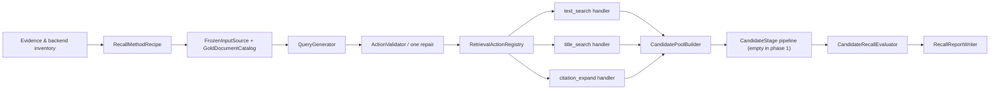

# 模块化候选池召回实验台设计

## 1. 背景

当前检索实验通常为每个假设编写独立脚本。脚本同时处理方法逻辑、冻结输入、LLM 调用、Provider 调用、预算账本、快照、回放、完整性校验、指标和 Gate。该结构适合封存正式证据，但不适合快速复用：更换搜索词生成方法时，会重复实现大量与方法无关的外围流程。

本设计建立一个模块化的候选池召回实验台。第一阶段只回答一个问题：给定搜索词生成或检索方法，完整候选池能够召回多少冻结 Gold 论文。过滤、排序、Top-50、最终 Precision/F1 和正式晋升在候选池召回满足要求后再单独设计。

实验台同时区分三件容易混淆的工作：

1. **框架正确性**：用历史固定动作和历史冻结响应进行精确回放，证明新框架没有改变候选池结果。
2. **生成方法可行性**：先生成和人工检查动作，再在有明确授权的真实检索后端上测试新动作的候选池召回。
3. **历史方法兼容性**：按每个历史方法自己的 Prompt、可见信息、模型、预算和候选池语义重新生成；不能用一个通用 Prompt 代表所有历史方法。

## 2. 目标与非目标

### 2.1 目标

- 普通搜索词生成方法只需新增或修改 Prompt/YAML，不再新写完整实验脚本。
- DeepSeek 可在 Oracle 模式查看 Gold 论文内容，用于验证搜索方法的召回可行性。
- Blind 模式完全隐藏 Gold，用于后续泛化验证。
- 文本搜索、标题搜索和引文扩展分别实现、分别测试，并通过注册表组合。
- 冻结输入来源、LLM 后端和检索后端均可替换，且不存在隐式联网回退。
- 候选池构建、召回评估、报告和错误处理均为独立模块。
- 为后续过滤、排序、筛选和多轮状态调整保留显式插槽，但第一阶段不启用这些阶段。
- 优先复用现有 OpenAlex、引用扩展、LLM、预算、快照、ID 规范化、去重和评测实现。
- 先做低成本输入/证据盘点；只有具备可测试条件的方法才进入完整实现与正式比较。
- 用历史冻结方法验证实验台：固定动作回放必须精确一致；重新生成只与可逐项重建的对应历史方法比较。

### 2.2 非目标

- 不训练或微调 LLM、Embedding、Reranker。
- 不在第一阶段评估过滤、排序、RRF、Top-50 或最终 F1。
- 不把三个 Oracle canary 查询解释为泛化能力或正式性能结论。
- 不实现基于 Gold 命中结果的在线搜索词调整。
- 不删除或覆盖历史脚本、封存运行和证据。
- 不在首版实现可执行任意新查询的本地全文索引；`local_index` 只保留为后续后端扩展点。

## 3. 前置可行性盘点

完整框架实现前先运行一个只读、无网络的 inventory 步骤，回答以下问题：

- 每个历史方法是否具有可定位的动作、Provider 响应、候选池、Gold 关联、指标和内容哈希；
- 证据粒度是 `exact`、`aggregate_only` 还是 `insufficient`；
- Oracle Gold 文档目录是否覆盖选定查询，至少是否具有非空标题；
- 每个动作能否由 `snapshot_replay` 精确命中，还是必须使用 `live_provider`；
- 历史方法使用的是哪一种候选池语义；
- 若要做重新生成比较，Prompt、Gold 可见性、模型、温度、动作上限和预算是否可重建。

盘点结果写入新的 inventory artifact，不修改历史目录。每个历史来源必须绑定明确路径和预期 SHA-256；实施前后重新计算哈希，证明旧证据未被修改。

盘点不要求五个历史方法全部完整才允许开发通用框架，但会提前给出结论上限：

- `exact`：可进行固定动作精确回放；
- `aggregate_only`：只能核对可证明的聚合字段；
- `insufficient`：不能进入对应的历史一致性结论；
- `not_comparable`：数据存在，但方法身份、可见性、后端或候选池语义无法对齐。

方案 B 的整体历史兼容性验收至少需要两个 `exact` 来源，其中一个是文本搜索，另一个是标题或引文方法。若盘点未满足该条件，仍可实现和测试核心模块，但不得声称方案 B 已完成整体历史兼容性验收；应先单独冻结缺失证据或缩小结论范围。

## 4. 总体架构



组合根只负责根据配置装配接口，不包含方法判断。注册表只映射动作名到处理器；删除、添加或替换处理器不影响生成器、候选池和评估器。

### 4.1 包结构与依赖方向

```text
src/paper_search/recall_experiments/
  contracts.py
  inventory.py
  recipes.py
  inputs/
    frozen.py
    gold_catalog.py
  generation/
    generators.py
    backends.py
    validation.py
  retrieval/
    registry.py
    backends.py
    text_search.py
    title_search.py
    citation_expand.py
  candidate_pool.py
  stages.py
  evaluator.py
  artifacts.py
  runner.py
```

依赖方向固定为 `contracts <- 各独立实现 <- runner/组合根`：

- `contracts.py` 不导入具体 Provider、LLM 或本地文件适配器。
- 三个检索处理器不得互相导入。
- 检索处理器只依赖 `SearchBackend` / `CitationBackend` 协议，不直接创建 live client、快照 reader 或本地索引。
- `DeepSeekPromptGenerator` 只依赖 `LLMBackend`，不直接调用 analyzer 或操作预算账本。
- `FrozenInputSource` 不导入生成器或检索处理器。
- `CandidatePoolBuilder` 不导入评估器；评估器可以读取候选池快照。
- `runner.py` 只编排接口，不包含动作类型分支、指标公式或方法专属常量。
- 注册表由组合根显式构造，不使用导入副作用或进程级可变全局注册。

测试目录镜像上述模块边界。任何普通新方法若需要修改 `runner.py` 中的方法分支，即视为模块化验收失败。

## 5. 模块边界

### 5.1 `RecallMethodRecipe`

方法配置是实验的唯一声明入口，至少包含：

```yaml
method_id: query-evolution-v2
generator:
  type: deepseek_prompt
  prompt: configs/prompts/recall/reproduce-query-evolution.yaml
  model: deepseek-v4-flash
  temperature: 0
  gold_visibility: oracle
  max_generated_actions: 2
  repair_attempts: 1
retrieval:
  allowed_actions: [text_search]
  backend: live_provider
  max_results_per_action: 50
  max_total_actions: 3
candidate_pool:
  policy_version: production-dedup-v1
evaluation:
  repeat_count: 3
  max_repeat_attempts: 5
  compare_with: historical-query-evolution-v2
  gold_count_tolerance: 1
  macro_recall_tolerance: 0.02
  retained_gold_min: 0.90
  required_passing_repeats: 2
```

配置加载器禁止未知字段并校验自身可判定的跨字段约束，例如动作类型与动作上限。Oracle/Blind 样本隔离、Gold 与 seed 隔离等依赖实际输入的约束，由加载 recipe 和 dataset 后的统一 preflight 校验，不能在 recipe loader 中假装完成。

方法配置不允许嵌入任意 Python 路径或执行任意代码。`candidate_pool.policy_version` 是冻结实验语义的一部分，不能在看到结果后修改。

### 5.2 `FrozenInputSource` 与评测私有材料

冻结输入通过协议读取：

```text
load_queries(sample_binding) -> FrozenRecallDataset
load_historical_baseline(binding) -> HistoricalRecallBaseline | None
```

适配器负责验证原始字节、显式路径与哈希，解析查询、Gold 关联、历史绑定和依赖快照，并返回：

- 可供生成使用的查询内容；
- 仅供组合 preflight / evaluator 使用的 opaque evaluation materials；
- 历史比较所需的可证明字段及其证据粒度。

`FrozenInputSource` 自身校验查询 ID 唯一、输入哈希和原始分区；只有 evaluator preflight 可以解析 identifier map，验证解析后的 Gold 关联唯一、Oracle/Blind 不重叠、Gold 与 citation seed 不重叠，以及历史比较分母一致。identifier map 不进入生成器、检索处理器或候选池构建器。

### 5.3 `GoldDocumentCatalog`

Oracle 需要可读的 Gold 文献内容，但现有 Gold 关联文件不一定包含题录元数据，因此必须有显式生产者：

```text
GoldDocumentCatalogBuilder.build(
  gold_associations,
  bound_normalized_paper_sources,
) -> SealedGoldDocumentCatalog
```

构建顺序固定为：

1. 优先从 inventory 中显式绑定、已冻结且具有哈希的规范化论文记录或 Provider 快照提取；
2. 不能从既有证据覆盖的条目记为缺失，不自动联网补齐；
3. 若标题缺失导致 Oracle 不可运行，必须另行获得联网/费用授权，通过现有 live provider、预算、快照和账本机制精确补齐，再封存新版目录。

私有目录记录 `query_id`、Gold evaluation ID 和文档内容，用于 evaluator 关联；注入 DeepSeek 的 `GoldDocument` 只包含：

```text
title                  # 必须非空
abstract               # 可为空
authors                # 可为空列表
year                   # 可为空
metadata_coverage      # 只描述字段是否存在
```

所有 ID、DOI、Provider URL、Provider request ID 和其他可直接提交的标识符都必须在构造 generation context 前移除。目录本身及其来源绑定写入 SHA-256；preflight 要求每个 Oracle Gold 关联至少有非空标题，并在报告中记录摘要、作者、年份覆盖率。

### 5.4 `QueryGenerator` 与 `LLMBackend`

统一生成输入为 `RecallGenerationContext`：

```text
query_id
original_query
query_spec
seed_queries
seed_candidates
observable_state
gold_documents
```

- Oracle 的 `gold_documents` 来自封存目录，包含标题和所有可用题录内容，不包含标识符。
- Blind 完全移除 `gold_documents`。
- `seed_candidates` 只包含实验开始前已冻结、可由 Provider 验证的非 Gold 候选及规范 ID。
- `observable_state` 只允许包含候选数量、重复率、文本特征和 Provider 状态等运行时可观察信息，不允许包含 Gold 命中情况。
- 第一阶段允许 `observable_state=null`，且不实现自动多轮搜索词调整；后续状态分类器可通过该字段独立插入。

首版生成器：

- `DeepSeekPromptGenerator`：根据 Prompt 生成搜索动作；
- `FixedActionGenerator`：读取历史搜索动作，用于精确回放；
- `ManualActionGenerator`：读取人工预先写好的动作，用于不调用 LLM 的快速对照。

`DeepSeekPromptGenerator` 通过 `LLMBackend.generate` 调用模型。`BudgetedLLMBackend` 负责 analyzer 所需的 `BudgetReservation`、快照和账本闭环：初次生成和修复调用分别获得独立 reservation；每个 reservation 必须以 usage 或明确失败状态终结。

新增普通搜索词方法通常只增加 Prompt/YAML。只有新增生成机制或 LLM 执行后端时才实现新类。

### 5.5 `RecallSearchAction` 与执行上下文

三种严格载荷为：

```text
TextSearchPayload(query_text)
TitleSearchPayload(title_text)
CitationExpandPayload(seed_canonical_id, direction, limit)
```

动作在执行前完成 Unicode/空白规范化、长度、允许类型和同轮去重校验。标题文本的规范化在生成/校验层完成；`TitleSearchHandler` 不调用面向原始 LLM 文本的 `extract_title_candidates`，而是将已验证的 `title_text` 作为普通 Provider 查询。现有 title candidate 实现仅作为搜索行为和 provenance 的参考。

检索处理器统一接收不含 Gold 的上下文：

```text
RetrievalExecutionContext(
  query_id,
  provider_filters,
  max_results_per_action,
  seed_candidates,
)

RetrievalActionHandler.execute(action, context) -> RetrievalActionResult
```

`CitationExpandPayload.seed_canonical_id` 必须存在于 `seed_candidates`。引文动作结果包括所选冻结 seed 与新增 neighbors，provenance 分别标记 `seed` 和 `expanded`，从而与历史“原候选 + 扩展新增”的候选池语义一致。动态执行“先搜索、再选新种子、再扩展”属于后续多轮协调器，不进入首版 Runner。

### 5.6 注册表与检索后端

```text
register(action_type, handler)
unregister(action_type)
resolve(action_type) -> RetrievalActionHandler
```

三个首版处理器分别为：

- `TextSearchHandler`：通过注入的 `SearchBackend.search` 执行普通文本查询；
- `TitleSearchHandler`：将完整标题作为普通查询传给同一可替换 backend；除非 backend 明确验证 exact-title 契约，否则不宣称精确标题匹配；
- `CitationExpandHandler`：通过 `CitationBackend` 复用现有 citation provider、预算、快照和图规范化能力。

`snapshot_replay` 只能回放历史上已封存且 request identity 完全一致的请求。未知的手工或 DeepSeek 新动作必须返回 `snapshot_unavailable`，不得静默联网，也不得被解释为零结果。因此：

- 历史固定动作可以零网络精确回放；
- 手工/DeepSeek 生成的新动作可以离线生成、校验和审阅，但候选召回必须使用明确授权的 `live_provider`；
- 只有未来实现了能执行任意查询的 `local_index`，新动作才可能做真实离线召回测试。

检索后端与冻结输入来源是两个独立扩展点。只要满足相同协议，替换后端不修改生成器、动作处理器、候选池或评估器。

### 5.7 `CandidatePoolBuilder` 与版本化语义

候选池构建器负责收集动作结果、规范化、去重、保留 provenance，并输出未过滤、未重排、未截断的完整候选池。候选池构建器不得读取 Gold 或 identifier map。

首版支持显式版本化策略：

- `production-dedup-v1`：复用生产管线的 `deduplicate_papers`，作为新实验的默认语义；
- `canonical-id-first-v1`：按规范 ID 保留第一次出现的旧探针语义，仅用于复现明确使用该语义的历史证据。

每个 historical binding 必须声明 `candidate_pool_policy_version`。精确回放按历史来源的锁定语义重建；新方法统一使用 `production-dedup-v1`。若历史与新方法语义不同，报告必须分别展示投影结果或标记 `not_comparable`，不能把差异归因于搜索词。

### 5.8 可选 `CandidateStage` 管线

```text
apply(pool, context) -> StageResult
```

第一阶段 stage 列表必须为空，评估器直接接收原始候选池。未来过滤、Embedding、LLM 筛选、融合排序或截断分别实现独立 stage，并拥有各自单元测试和开关。

### 5.9 `CandidateRecallEvaluator`

评估器只计算候选池召回：每查询 Gold 总数与命中数、candidate recall、macro candidate recall、unique Gold association 命中、历史 Gold 保留率、有效重复分布和容差结论。不计算候选池 Precision、Top-K、最终 F1、MRR、NDCG 或晋升 Gate。

## 6. Oracle、Blind 与历史比较

### 6.1 Oracle 与 Blind

- Oracle 只用于确认方法在看到相关论文内容时能否生成有效搜索表达。
- Blind 用于后续确认规则能否迁移，不是第一阶段框架正确性的前置条件。
- 同一新方法若同时声明 Oracle 和 Blind，两阶段必须使用互不重叠的冻结查询 ID。
- 仅做历史兼容性复现时保持历史原有 Gold 可见性，不强行改成 Oracle。

人工快速 canary 可选择 3 个具有代表性 Gold 特征的查询，但它只验证数据流、动作合理性和候选召回是否明显失效，不构成性能结论。

### 6.2 框架精确回放

使用历史搜索动作和冻结 Provider 响应。规范候选 ID 集合、可证明的逐查询 Gold 命中、聚合 Gold 命中和 macro recall 必须与对应证据一致。若旧实验只有聚合证据，只比较可证明的聚合字段，不伪造逐查询一致性。

### 6.3 逐方法重新生成兼容性

每个历史方法拥有独立 reproduction recipe 和必要时独立 Prompt，例如：

```text
methods/reproduce-query-rewrite.yaml
methods/reproduce-query-variants.yaml
methods/reproduce-query-evolution.yaml
methods/reproduce-title-candidates.yaml
methods/reproduce-citation-expansion.yaml
```

重新生成只能在以下要素可对齐时比较：相同查询 ID、Gold 分母、Prompt 方法、Gold 可见性、模型、温度、动作上限、检索预算、后端和候选池策略。历史方法若未使用 DeepSeek，或原 Prompt/输入不可重建，结果标记为 `not_comparable` 或 `insufficient_historical_evidence`，不能把通用方案 B Prompt 的输出与其直接比较。

通用 `scheme-b-oracle` / `scheme-b-blind` 可以作为新的探索性方法，但不作为五个历史方法共同的等价性依据。

对满足可比条件的方法，取得 3 次有效重新生成结果，并满足：

- Gold association 命中数相对历史值误差不超过 `±1`；
- macro candidate recall 绝对误差不超过 `0.02`；
- 历史已命中 Gold 保留率不低于 `0.90`；
- 3 次有效结果中至少 2 次同时满足以上条件。

该结论只表示新实验台与对应旧候选召回流程在允许误差内一致，不评价历史方法本身是否优秀。

## 7. 尝试、错误和反馈边界

### 7.1 尝试与有效重复

调度最多进行 `max_repeat_attempts=5` 次 attempt，以取得 `repeat_count=3` 个 valid repeat。每次调度都有稳定 `attempt_id`；成功的 attempt 再获得 `valid_repeat_ordinal=1..3`。基础设施失败保留完整产物并计入五次调度上限，但不计入通过或失败统计。达到上限仍不足三个有效结果时，结论为 `insufficient_valid_repeats`。

### 7.2 生成错误修复

可修复错误包括：JSON 无法解析、动作重复、动作空或过长、动作类型不允许、年份冲突和缺少必填字段。LLM analyzer 返回的结构化 `invalid_json` 也属于可修复错误。反馈包含错误码、字段路径、上次输出和允许修改范围；`repair_attempts` 默认 1。

初次生成与修复是两个独立 LLM budget reservation。Provider、认证、限流、网络、快照缺失和账本失败属于 `infrastructure_failure`，不消耗语义修复次数，也不能改写 Prompt 后自动重试。

### 7.3 搜索状态

第一阶段不实现基于 Gold 的动态策略调整。接口为以后保留 `zero_results`、`low_yield`、`broad_noisy`、`facet_gap`、`duplicate_saturation`、`entity_ambiguity`、`provider_failure`、`adequate` 等非 Gold 状态；状态分类器以后作为独立模块接入 `observable_state`。

`not_retrieved`、`filtered_out`、`ranked_outside_top50` 等 Gold 诊断只能进入报告，不能进入运行时路由。

## 8. 产物与隐私

每次实验写出：

```text
recipe.lock.yaml
sample-manifest.json
source-inventory.json
generation/attempt-01/<query_id>.json
retrieval/attempt-01/<query_id>.json
candidate-pools/attempt-01/<query_id>.json
recall-report.json
```

manifest/report 对每次调度记录：

```text
attempt_id
attempt_status
valid_repeat_ordinal   # 1、2、3 或 null
```

隐私检查以结构为主：拒绝 identifier、DOI、Provider URL、OpenAlex/S2 ID、canonical ID、request ID 等禁用字段或标识符模式。普通标题或摘要中出现“OpenAlex”或“Semantic Scholar”等词语不构成泄露，不能仅按产品名称子串拒绝文档。

报告包含方法身份、输入与 Gold catalog 哈希、模型/Prompt、后端、候选池策略、动作数、候选数、逐查询召回、有效重复分布、历史比较、基础设施失败和容差结论，不包含正式晋升结论。

## 9. 复用边界

实现优先包装而不是复制以下现有能力：

- `paper_search.retrieval.openalex.OpenAlexProvider`
- `paper_search.retrieval.title_candidates` 的 Provider 查询与 provenance 行为
- `paper_search.graph.provider_stage` 的 citation expansion
- `paper_search.processing.normalize`
- `paper_search.processing.deduplicate.deduplicate_papers`
- `paper_search.evaluation.dataset.IdentifierMap`
- `paper_search.llm` 的 analyzer、live/replay 适配器和快照能力
- `paper_search.control` 的预算和账本能力

旧探针脚本和正式运行入口保持不变。实验台通过适配器复用代码，不将旧脚本作为库导入。

## 10. 测试策略

### 10.1 独立测试

- inventory 对路径、哈希、证据粒度、Gold catalog 覆盖和 backend 可执行性的分类；
- Recipe 解析、候选池策略和组合 preflight；
- FrozenInputSource 与 GoldDocumentCatalogBuilder；
- Fixed、Manual、DeepSeek 三种生成器；
- LLMBackend 的 reservation、usage、repair 和失败闭环；
- 动作校验、去重和一次修复；
- 注册、移除、替换 RetrievalActionHandler；
- snapshot 精确命中与未知请求 `snapshot_unavailable`；
- text/title/citation 三个处理器及 citation seed provenance；
- 两种版本化 CandidatePoolBuilder 语义；
- 空 CandidateStage 管线；
- CandidateRecallEvaluator、尝试/有效重复和容差判断；
- 报告序列化、重读及 identifier/URL 模式隐私扫描。

### 10.2 聚合测试

- 固定动作 + 冻结响应的零网络端到端测试；
- 每类动作各自的端到端 fixture；
- 混合三类动作的候选池聚合测试；
- Oracle/Blind 泄漏边界测试；
- generation failure 与 infrastructure failure 不混淆；
- 不同候选池策略的兼容性报告；
- 历史固定动作的可证明字段精确一致；
- 注入式确定性假结果验证 3/5 调度与 2/3 容差逻辑；
- 真实 DeepSeek/Provider 运行作为单独授权的手工实验，不纳入默认自动测试。

## 11. 分阶段实施

1. 只读 inventory：先确定历史证据、Gold 题录、快照可执行性和结论上限。
2. 核心契约、执行上下文、Recipe、Gold catalog、FrozenInputSource、注册表、固定生成器、候选池和评估器。
3. `text_search` 处理器与文本历史动作精确回放。
4. `title_search` 处理器与 Title Candidates 精确回放。
5. `citation_expand` 处理器与 Citation Expansion 精确回放。
6. LLMBackend、DeepSeek 生成器、一次错误修复和 Oracle/Blind 绑定。
7. CLI、attempt 产物和统一报告。
8. 每个可重建历史方法的独立 reproduction recipe/Prompt。
9. 获得明确网络/费用授权后，先运行 3-query Oracle canary，再运行可比方法的 3/5 一致性测试。

每阶段独立验证后再进入下一阶段；不得为了聚合测试通过而把方法逻辑重新放回统一 Runner。

## 12. 验收标准

- inventory 在完整实现前明确证据级别、Gold catalog 覆盖和每类动作需要的后端。
- 新增普通搜索词方法只需 Prompt/YAML；新增动作类型只需载荷、处理器和注册配置。
- 三类动作可独立注册、替换、移除和测试。
- 新动作不会错误使用历史快照；无授权时只允许离线生成/校验，不伪装成召回测试。
- Oracle 的每个 Gold 至少有标题，所有可用题录内容对 DeepSeek 可见，同时标识符不泄露。
- LLM 初次生成与修复均具有完整、独立的预算/快照/账本终态。
- 候选池策略显式版本化，历史与新方法语义差异不会被误归因于搜索词。
- 原始候选池在任何过滤、排序或截断前完成召回评估。
- 历史固定动作在可证明字段上精确一致；重新生成只与逐方法可重建的历史来源比较。
- 3-query canary 仅用于诊断；方案 B 的整体历史兼容性结论满足至少两个 exact 来源和对应 3/5、2/3 容差条件。
- 现有正式管线、历史脚本和封存证据内容哈希不变。
- 所有新增模块有独立单元测试，并有跨模块聚合测试。
